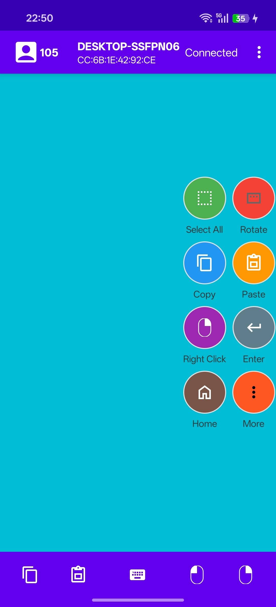
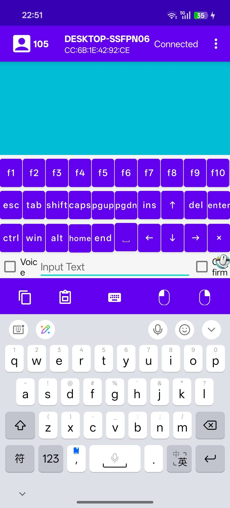
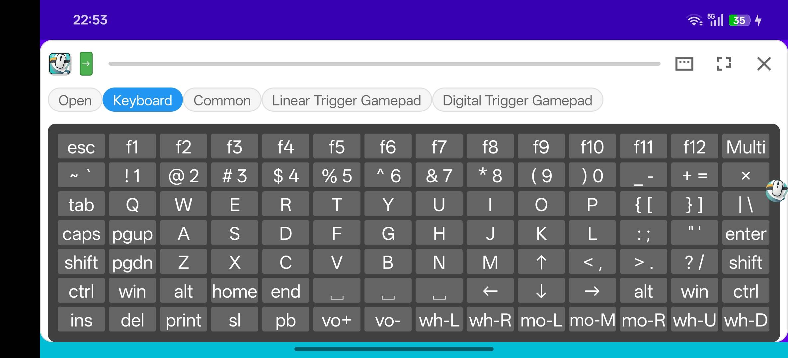
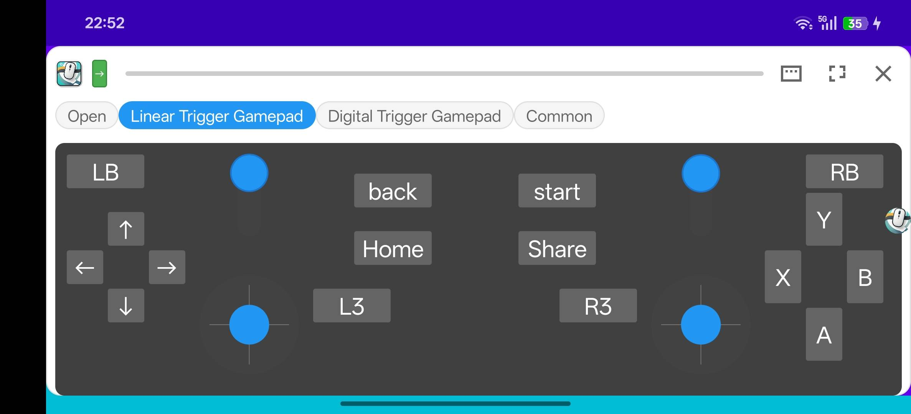

# PalmPoint – Phone as a PC Input Device

📱 **PalmPoint** is a android mobile mouse application that turns your phone into a wireless  
**mouse, touchpad, keyboard, and gamepad**.

> **Note**: This repository is currently used for version releases only. Source code is not available at this time.

With PalmPoint, you can control your PC using intuitive touch gestures and
virtual keyboard input — all from your phone.

---

## 📥 Download

1. **PalmPoint (Android)** — [PalmPoint.apk](https://github.com/PalmPoint/PalmPoint-PhoneInput/releases/download/release/PalmPoint.apk)
2. **PalmPoint Host (Windows)** — [PalmPointHost-Global-win.zip](https://github.com/PalmPoint/PalmPoint-PhoneInput/releases/download/release/PalmPointHost-Global-win.zip)
3. **PalmPoint Host (Linux)** — [PalmPointHost-x86_64.AppImage](https://github.com/PalmPoint/PalmPoint-PhoneInput/releases/download/release/PalmPointHost-x86_64.AppImage)
4. **PalmPoint Host (macOS)** — [PalmPointHost-Global.dmg](https://github.com/PalmPoint/PalmPoint-PhoneInput/releases/download/release/PalmPointHost-Global.dmg)

> **PalmPoint Host** is the PC-side companion app required for full keyboard, gamepad, and other advanced features. Download and run it on your Windows, Linux, or macOS computer before connecting from your phone.

---

## ✨ Features

- 🖱️ Use your phone as a **mouse**
- ⌨️ Type using a **virtual keyboard**
- 🖐️ Touchpad-style gesture control
- 📡 Wireless connection (Bluetooth)
- 🎮 Use your phone as a **gamepad**
- 🖥️ Control PC remotely from your phone

---

### Version Information

**Version 6.0.1** (Released 2026-05-16)  
**What's New:**
- WiFi connection mode
- Action mode
- Function keyboard can be hidden
- Customizable main interface background color
- PalmPoint Host (Window|Linux|Mac) released alongside this version

**Version 4.0.2** (Released 2025-12-27)  
**What's New:**
- Support for email registration
- Resizable floating window
- Added rotation button to floating button array
- Added three-finger gesture support
- Support for English interface

---

## 📸 Screenshots

---

## 🔗 Links

- **YouTube**: [PalmPoint Channel](https://youtube.com/@palmpoint-e8v2d?si=5tcpTu69sFfHnx1k)

---

## 📘 Usage Instructions

### Basic Settings

1. **Input Mode Configuration**  
   Configure flying mouse mode or touchpad mode in the settings interface, along with cursor and scroll wheel speed.

2. **Flying Mouse Mode**
   - Quick swipe on the touch control triggers right-click
   - Long swipe triggers scroll wheel operation

3. **Touchpad Mode - Single Finger**
   - Press for 200ms to trigger vibration, then:
     - **Slide**: Mouse click-and-drag effect (cursor moves with mouse button pressed)
     - **No slide + 500ms**: Triggers right-click
   - **Quick swipe three times**: Switches to scroll wheel mode (cursor stops moving, scrolling enabled)
   - **Tap once**: Returns to cursor mode

4. **Touchpad Mode - Multi-touch**
   - **Two-finger press**: Right-click
   - **Two-finger slide**: Scroll wheel operation
   - **Three-finger gestures**: Windows-style operations

### Keyboard & Buttons

5. **Bottom Button Bar**  
   The bottom buttons (left to right): **[Copy] [Paste] [Keyboard] [Copy] [Left Click] [Right Click]**
   - Tap **[Keyboard]** to show/hide the virtual keyboard
   - Other buttons provide quick access to keyboard shortcuts

6. **Keyboard Features**
   - F1~F12 function keys can be scrolled horizontally

7. **Text Input Options**
   - **[Voice/Delay] checkbox**: When enabled, delays text transmission after text box changes (useful for voice input adjustment)
   - Configure delay time in settings based on your device
   - **[Confirm] checkbox**: When enabled, automatically appends space during Chinese input to confirm the first option in PC input method interface
   - Without this option, you need to send space or number to confirm during Chinese input on the phone

### Floating Window & Background

8. **Background Operation**  
   Requires manual grant of "Display over other apps" permission. After jumping to settings page, find PalmPoint APP and allow it.

9. **Floating Window Controls**
   - Drag the floating button array to screen edges to hide it
   - Drag the floating window border to move it
   - Drag the bottom indicator bar slowly to resize the floating window
   - Quick swipe up on the indicator bar to hide the floating window
   - In landscape mode, floating button array shows half; drag to switch to the other half

10. **Axis Orientation**  
    Double-tap the axis button (behind the icon in the upper-left corner) to change axis orientation. Generally not needed, but useful if orientation doesn't match your usage habits.

### Button Groups & Customization

11. **Button Groups**
    - Support import/export of button groups
    - **Important**: Backup your custom button group files before reinstalling the app, then import after reinstallation
    - Edit button groups to merge buttons or split merged buttons

### Display & Orientation

12. **Landscape Mode**
    - Main interface does not support landscape when running in background
    - Floating button array only displays half in landscape; drag to switch to the other half

---

## 🔮 Future Plans

1. Support for custom background images
2. ... (We welcome your feedback!)

---

## ❓ FAQ (Frequently Asked Questions)

### Connection Issues

**Q: Can't find PC or tablet via Bluetooth**

1. PC/tablet may not be broadcasting. Try turning Bluetooth off and on again
2. Adjust the Bluetooth signal strength threshold slider to lower values to see if device appears

**Q: Too many Bluetooth devices or need to rename**

1. Search for devices by partial keyword match
2. Device list is sorted by Bluetooth signal strength (strongest first = closest)

**Q: PC doesn't have Bluetooth**

- Purchase a USB Bluetooth adapter

**Q: Connection to PC or tablet fails**

- Cancel pairing on both devices and try again
- If still failing, after canceling pairing, search for the phone from PC/tablet and initiate pairing from there

### Feature Issues

**Q: New features (keyboard, gamepad, etc.) don't work**

- If upgrading from an old version that only had mouse functionality, PC may not recognize new features
- Solution: Cancel pairing on both devices, then reconnect

---

## 📄 License

See [LICENSE](LICENSE) file for details.

---